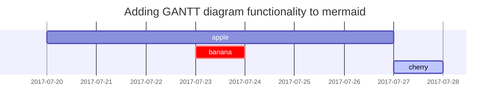



*Note: You can click the button at the end of each lines, but you may not open successfully because some of them include private information. If you are interested you can [email](mailto:sjs@mail.bnu.edu.cn) at me.*

Academic
---
Beijing Normal University, Bachelor, Sep 2021 – June 2025

* This is his Academic Transcript of outstanding results obtained with his deep understanding of his major. [Click]({{site.url}}/file/本科生英文成绩单.pdf)
  
* His GPA was the top in the major and exceeded the second place by six points (under the percentage system). [Click]({{site.url}}/file/Shengjie_SONG's_Grade_at_bachalor.pdf)
  
* He received a National Scholarship and the school's highest honour.

  * National Scholarship (Top 1% of the university, highest scholarship from Ministry of Education of China) [Click]({{site.url}}/file/国家奖学金.pdf)
 
  * The First Prize Scholarship (Top 10% of the school, highest academic honor at BNU) [Click]({{site.url}}/file/京师一等奖学金.pdf)
 
Leadership and Volunteering
---
* The Third Conference of the lnternational Science, Technology and innovation Forum of Boao Forum for Asia ([ISTIF](https://www.boaoforum.org/themed/istif/2023/index_1.html))  [Click]({{site.url}}/file/2023年10月+优秀志愿者+博鳌亚洲论坛.pdf)
  
* [THE SIXTH CHINA EDUCATION INNOVATION EXPO](https://news.bnu.edu.cn/zx/ttgz/2091c3219be24fb8b3ad5fdab16d93ce.htm)  [Click]({{site.url}}/file/教博会.pdf)
  
* Student Union’s General Affairs Minister [Click]({{site.url}}/file/教育培训部部门负责人证明.pdf)

Qualification and Part-time Work
---
* He has obtained national qualification in both accounting and edcation area, such as,
  
  * Accounting Professional and Technical Qualification Certificate (Junior)  [Click]({{site.url}}/file/初级会计.pdf)
    
  * Higher Secondary [Mathematics]({{site.url}}/file/数学教师.pdf) & [English]({{site.url}}/file/英语教师.pdf) Teaching Qualifications

* He often works as a teaching assistant in high school and English-learning institutions, for example,
  
  * Chinese Teaching  [Click]({{site.url}}/file/【教育实习】乘风语文实习.pdf)
    
  * English Teaching
    
  * Arts Teaching [Click]({{site.url}}/file/【教育实习】宋圣洁实习证明.pdf)


Interests
---
* He possesses excellent linguistic skills, including
  
  * English IELTS 6.5 (Listening 6.5, Reading 7, Speaking 6.5, Writing 6.5) [Click]({{site.url}}/file/雅思成绩单.pdf)
    
  * 中文(Mandarin)一级乙等(Highest level of qualification examination) (Native speaker) [Click]({{site.url}}/file/普通话一级乙等.pdf)
    
  * 日本語／にほんご(Japanese) (Beginner).
    
* He loves Interdisciplinary Learning, for example, he attending lectures on

  * July, 2024, Certificate of Achievement Awarded to Shengjie SONG for succesopully completing [Society Hub Summer Camp]({{site.url}}/file/HKUST(GZ).pdf) for PhD Admission in Fall 2025
 
  * July, 2024， [Postgraduate Forum]({{site.url}}/file/pku教育经济加密.pdf) on Economics of Education in Peking University
 
  * July, 2024, Outstanding Undergraduate Summer Camp, School of Systems Science, awarded [Outstanding Camper]({{site.url}}/file/系统科学学院优秀营员.pdf)) in Beijing Normal University

  * June, 2024, Open FIESTA Summer Camp and SDG Olympiad at Tsinghua University (got [BRONZE PRIZE]({{site.url}}/file/thu铜.pdf))

  * April, 2024, Faculty of Humanities of the University of Macau (successfully participation as [speaker]({{site.url}}/file/澳门大学.pdf)) in University of Macao

  * June, 2023, Introduction to Mathematical Theory on Fluids (got score [98]({{site.url}}/file/数学系列讲座3.pdf)) in Beijing Normal University
    
  * June, 2023, Modes and Approximate Standard Types (got score [95]({{site.url}}/file/数学系列讲座1.pdf)) in Beijing Normal University
      
* He is also willing to embrace new thins, for instance,
  
  * Travelled to more than 30 cities in China and shared personal experience on social platform called Little Red Book and obtain over 10,000 fans (following him by clicking [here](https://www.xiaohongshu.com/user/profile/619e2dd9000000001000afa2?xhsshare=CopyLink&appuid=619e2dd9000000001000afa2&apptime=1718706118&share_id=94e7a172ea274f2d8a05a0a083ca32af)).
    
  * Sports and Bodybuilding (Badminton, Table Tennis, Swimming, Climbing and Camping etc.) and some [official camps]({{site.url}}/file/卓越训练营.pdf) to improve my overall quality.

---
title: Text and Typography
description: Examples of text, typography, math equations, diagrams, flowcharts, pictures, videos, and more.
author: cotes
date: 2019-08-08 11:33:00 +0800
categories: [Blogging, Demo]
tags: [typography]
pin: true
math: true
mermaid: true
image:
  path: /commons/devices-mockup.png
  lqip: data:image/webp;base64,UklGRpoAAABXRUJQVlA4WAoAAAAQAAAADwAABwAAQUxQSDIAAAARL0AmbZurmr57yyIiqE8oiG0bejIYEQTgqiDA9vqnsUSI6H+oAERp2HZ65qP/VIAWAFZQOCBCAAAA8AEAnQEqEAAIAAVAfCWkAALp8sF8rgRgAP7o9FDvMCkMde9PK7euH5M1m6VWoDXf2FkP3BqV0ZYbO6NA/VFIAAAA
  alt: Responsive rendering of Chirpy theme on multiple devices.
---

## Headings

<!-- markdownlint-capture -->
<!-- markdownlint-disable -->
# H1 — heading
{: .mt-4 .mb-0 }

## H2 — heading
{: data-toc-skip='' .mt-4 .mb-0 }

### H3 — heading
{: data-toc-skip='' .mt-4 .mb-0 }

#### H4 — heading
{: data-toc-skip='' .mt-4 }
<!-- markdownlint-restore -->

## Paragraph

Quisque egestas convallis ipsum, ut sollicitudin risus tincidunt a. Maecenas interdum malesuada egestas. Duis consectetur porta risus, sit amet vulputate urna facilisis ac. Phasellus semper dui non purus ultrices sodales. Aliquam ante lorem, ornare a feugiat ac, finibus nec mauris. Vivamus ut tristique nisi. Sed vel leo vulputate, efficitur risus non, posuere mi. Nullam tincidunt bibendum rutrum. Proin commodo ornare sapien. Vivamus interdum diam sed sapien blandit, sit amet aliquam risus mattis. Nullam arcu turpis, mollis quis laoreet at, placerat id nibh. Suspendisse venenatis eros eros.

## Lists

### Ordered list

1. Firstly
2. Secondly
3. Thirdly

### Unordered list

- Chapter
  - Section
    - Paragraph

### ToDo list

- [ ] Job
  - [x] Step 1
  - [x] Step 2
  - [ ] Step 3

### Description list

Sun
: the star around which the earth orbits

Moon
: the natural satellite of the earth, visible by reflected light from the sun

## Block Quote

> This line shows the _block quote_.

## Prompts

<!-- markdownlint-capture -->
<!-- markdownlint-disable -->
> An example showing the `tip` type prompt.
{: .prompt-tip }

> An example showing the `info` type prompt.
{: .prompt-info }

> An example showing the `warning` type prompt.
{: .prompt-warning }

> An example showing the `danger` type prompt.
{: .prompt-danger }
<!-- markdownlint-restore -->

## Tables

| Company                      | Contact          | Country |
| :--------------------------- | :--------------- | ------: |
| Alfreds Futterkiste          | Maria Anders     | Germany |
| Island Trading               | Helen Bennett    |      UK |
| Magazzini Alimentari Riuniti | Giovanni Rovelli |   Italy |

## Links

<http://127.0.0.1:4000>

## Footnote

Click the hook will locate the footnote[^footnote], and here is another footnote[^fn-nth-2].

## Inline code

This is an example of `Inline Code`.

## Filepath

Here is the `/path/to/the/file.extend`{: .filepath}.

## Code blocks

### Common

```text
This is a common code snippet, without syntax highlight and line number.
```

### Specific Language

```bash
if [ $? -ne 0 ]; then
  echo "The command was not successful.";
  #do the needful / exit
fi;
```

### Specific filename

```sass
@import
  "colors/light-typography",
  "colors/dark-typography";
```
{: file='_sass/jekyll-theme-chirpy.scss'}

## Mathematics

The mathematics powered by [**MathJax**](https://www.mathjax.org/):

$$
\begin{equation}
  \sum_{n=1}^\infty 1/n^2 = \frac{\pi^2}{6}
  \label{eq:series}
\end{equation}
$$

We can reference the equation as \eqref{eq:series}.

When $a \ne 0$, there are two solutions to $ax^2 + bx + c = 0$ and they are

$$ x = {-b \pm \sqrt{b^2-4ac} \over 2a} $$

## Mermaid SVG



## Images

### Default (with caption)

{: width="972" height="589" }
_Full screen width and center alignment_

### Left aligned

{: width="972" height="589" .w-75 .normal}

### Float to left

{: width="972" height="589" .w-50 .left}
Praesent maximus aliquam sapien. Sed vel neque in dolor pulvinar auctor. Maecenas pharetra, sem sit amet interdum posuere, tellus lacus eleifend magna, ac lobortis felis ipsum id sapien. Proin ornare rutrum metus, ac convallis diam volutpat sit amet. Phasellus volutpat, elit sit amet tincidunt mollis, felis mi scelerisque mauris, ut facilisis leo magna accumsan sapien. In rutrum vehicula nisl eget tempor. Nullam maximus ullamcorper libero non maximus. Integer ultricies velit id convallis varius. Praesent eu nisl eu urna finibus ultrices id nec ex. Mauris ac mattis quam. Fusce aliquam est nec sapien bibendum, vitae malesuada ligula condimentum.

### Float to right

{: width="972" height="589" .w-50 .right}
Praesent maximus aliquam sapien. Sed vel neque in dolor pulvinar auctor. Maecenas pharetra, sem sit amet interdum posuere, tellus lacus eleifend magna, ac lobortis felis ipsum id sapien. Proin ornare rutrum metus, ac convallis diam volutpat sit amet. Phasellus volutpat, elit sit amet tincidunt mollis, felis mi scelerisque mauris, ut facilisis leo magna accumsan sapien. In rutrum vehicula nisl eget tempor. Nullam maximus ullamcorper libero non maximus. Integer ultricies velit id convallis varius. Praesent eu nisl eu urna finibus ultrices id nec ex. Mauris ac mattis quam. Fusce aliquam est nec sapien bibendum, vitae malesuada ligula condimentum.

### Dark/Light mode & Shadow

The image below will toggle dark/light mode based on theme preference, notice it has shadows.

{: .light .w-75 .shadow .rounded-10 w='1212' h='668' }
{: .dark .w-75 .shadow .rounded-10 w='1212' h='668' }

## Video



## Reverse Footnote

[^footnote]: The footnote source
[^fn-nth-2]: The 2nd footnote source

